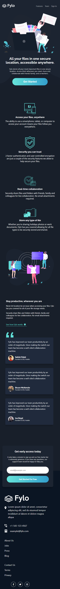

# Frontend Mentor - Fylo dark theme landing page

## Welcome! 👋

Thanks for checking out this front-end coding challenge.

### Screenshot
## The challenge

Your challenge is to build out this landing page and get it looking as close to the design as possible.

You can use any tools you like to help you complete the challenge. So if you've got something you'd like to practice, feel free to give it a go.

Your users should be able to: 

- View the optimal layout for the site depending on their device's screen size
- See hover states for all interactive elements on the page

- [Live Site](https://z3shan7.github.io/dark-theme-landing-page/)

## Author

- Frontend Mentor - [@z3shan7](https://www.frontendmentor.io/profile/z3shan7)

